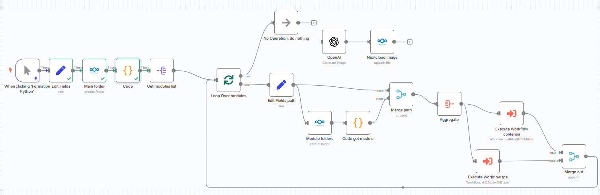

# Formation Python

J'ai utilisé n8n et les agents AI pour générer un cours pour le language de programmation Python

A partir d'une liste de modules avec un contenu, un objectif et des TPS substanciels voir plus loin.

Voir l'image du workflow dans n8n:



Table de matière du cours:
````XML
[
  {
    "formation_python": {
      "modules": [
        {
          "nom": "Introduction à Python",
          "objectif": "Comprendre l’environnement Python et savoir écrire ses premiers scripts.",
          "contenu": [
            "Installation de Python et outils",
            "Exécution de scripts",
            "Variables et types de base",
            "Entrées/sorties utilisateur",
            "Opérations arithmétiques et logiques"
          ],
          "tps": [
            "Hello World interactif",
            "Calculatrice basique",
            "Convertisseur de température"
          ]
        },
        {
          "nom": "Contrôle de flux",
          "objectif": "Savoir contrôler l’exécution d’un programme avec des conditions et des boucles.",
          "contenu": [
            "Instructions conditionnelles",
            "Boucles for et while",
            "Break et continue",
            "Itération sur des listes"
          ],
          "tps": [
            "Jeu du nombre mystère",
            "Générateur de tables de multiplication",
            "Analyse de notes d’élèves"
          ]
        },
        {
          "nom": "Fonctions et portée",
          "objectif": "Maîtriser la création de fonctions pour organiser son code.",
          "contenu": [
            "Définir et appeler des fonctions",
            "Paramètres et retours",
            "Portée des variables",
            "Fonctions intégrées vs personnalisées"
          ],
          "tps": [
            "Calcul de factorielle",
            "Générateur de mot de passe",
            "Convertisseur d’unités"
          ]
        },
        {
          "nom": "Structures de données",
          "objectif": "Savoir manipuler des collections de données.",
          "contenu": [
            "Listes, tuples, sets, dictionnaires",
            "Méthodes de manipulation",
            "Compréhensions de listes",
            "Parcours et traitement"
          ],
          "tps": [
            "Carnet d’adresses",
            "Analyse de texte",
            "Système de votes"
          ]
        },
        {
          "nom": "Programmation orientée objet",
          "objectif": "Apprendre à structurer le code avec des classes et objets.",
          "contenu": [
            "Classe, instance, attributs, méthodes",
            "Constructeur __init__",
            "Encapsulation, héritage, polymorphisme",
            "Méthodes spéciales"
          ],
          "tps": [
            "Gestion d’un zoo",
            "Système de comptes bancaires",
            "Mini RPG"
          ]
        },
        {
          "nom": "Fichiers et exceptions",
          "objectif": "Lire, écrire des fichiers et gérer les erreurs.",
          "contenu": [
            "Fichiers texte et CSV",
            "Gestion avec with",
            "Gestion des erreurs avec try/except",
            "Modules os et csv"
          ],
          "tps": [
            "Journal de bord",
            "Analyse d’un fichier CSV",
            "Authentification avec fichiers"
          ]
        },
        {
          "nom": "Modularité et bibliothèques",
          "objectif": "Structurer des projets avec des modules et utiliser des bibliothèques.",
          "contenu": [
            "Modules et packages",
            "Importation",
            "Virtualenv",
            "Modules standard"
          ],
          "tps": [
            "Application météo simulée",
            "Timer/chrono",
            "Projet modulaire multi-fichiers"
          ]
        },
        {
          "nom": "Python pour l’administration système",
          "objectif": "Automatiser des tâches systèmes avec Python.",
          "contenu": [
            "Gestion de fichiers",
            "Commandes système avec subprocess",
            "Surveillance avec psutil",
            "SSH avec paramiko"
          ],
          "tps": [
            "Sauvegarde automatique",
            "Surveillance de disque",
            "Redémarrage distant"
          ]
        },
        {
          "nom": "Analyse de données",
          "objectif": "Manipuler et visualiser des données avec pandas et matplotlib.",
          "contenu": [
            "Chargement de données",
            "Nettoyage et transformation",
            "Agrégation et filtres",
            "Visualisations graphiques"
          ],
          "tps": [
            "Analyse des ventes",
            "Visualisation météo",
            "Bilan de résultats scolaires"
          ]
        },
        {
          "nom": "Machine learning avec scikit-learn",
          "objectif": "Découvrir l'entraînement de modèles prédictifs.",
          "contenu": [
            "Modèles supervisés",
            "Préparation des données",
            "Évaluation des performances",
            "Utilisation de scikit-learn"
          ],
          "tps": [
            "Prédiction de prix immobiliers",
            "Classification de spam",
            "Visualisation de frontière de décision"
          ]
        },
        {
          "nom": "Création d’API REST",
          "objectif": "Concevoir une API REST avec Flask ou FastAPI.",
          "contenu": [
            "Routes GET/POST",
            "Sérialisation avec Pydantic",
            "Connexion à SQLite",
            "Test d’API avec Postman"
          ],
          "tps": [
            "API todo-list",
            "API de gestion d’utilisateurs",
            "API CRUD complet"
          ]
        },
        {
          "nom": "Deep learning avec TensorFlow ou PyTorch",
          "objectif": "Comprendre les bases des réseaux neuronaux.",
          "contenu": [
            "Réseaux de neurones (MLP)",
            "CNN",
            "Classification d’images ou textes",
            "Entraînement de modèles"
          ],
          "tps": [
            "Classification MNIST",
            "Détection de sentiment",
            "Reconnaissance d’images"
          ]
        },
        {
          "nom": "Applications mobiles avec Kivy",
          "objectif": "Créer une application mobile avec Python.",
          "contenu": [
            "Interface utilisateur avec Kivy",
            "Événements et interactions",
            "Stockage local"
          ],
          "tps": [
            "Prise de notes",
            "Calculatrice mobile",
            "Gestionnaire de tâches"
          ]
        },
        {
          "nom": "Automatisation bureautique",
          "objectif": "Automatiser la création de fichiers Excel, Word et envois email.",
          "contenu": [
            "Manipulation de fichiers Excel",
            "Génération de documents Word",
            "Envoi d’emails"
          ],
          "tps": [
            "Bulletins de notes Excel",
            "Fusion de rapports Word",
            "Envoi automatique par email"
          ]
        },
        {
          "nom": "Cybersécurité et réseau",
          "objectif": "Scripter des outils de test réseau et de sécurité.",
          "contenu": [
            "Analyse de paquets",
            "Scan de ports",
            "Scraping web",
            "Analyse de logs"
          ],
          "tps": [
            "Scanner de ports TCP",
            "Extracteur de mails web",
            "Analyse de logs système"
          ]
        }
      ]
    }
  }
]


````
